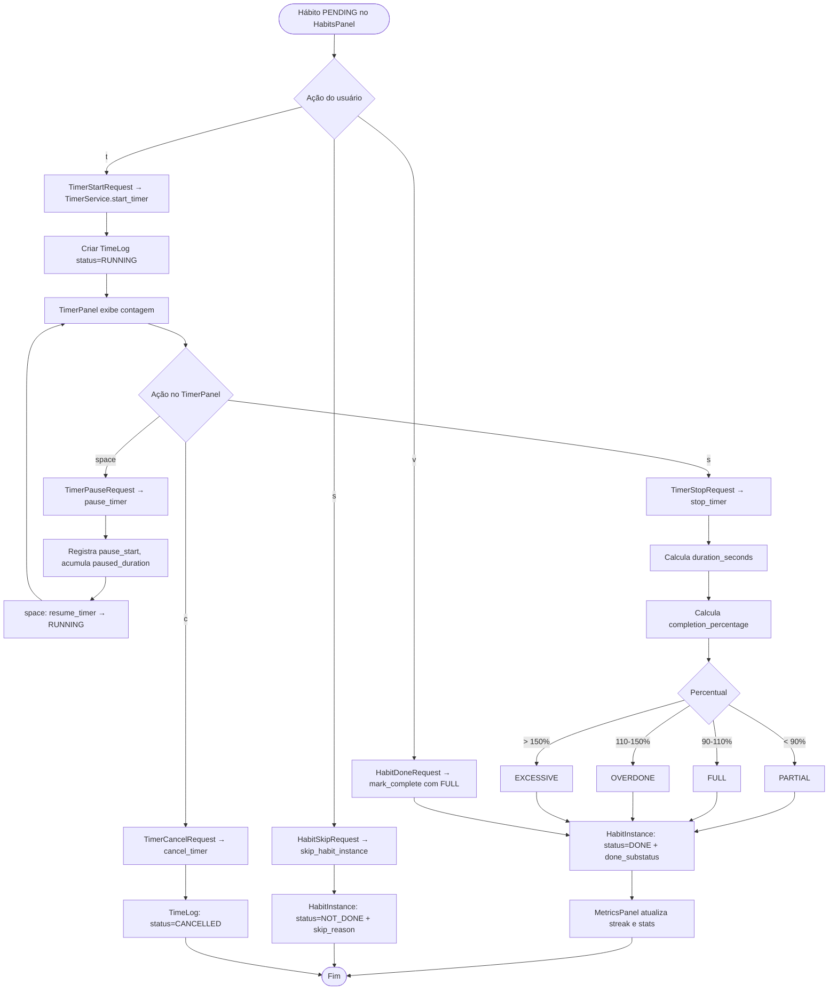

# Fluxo de Atividade: Executar Hábito

- **Status:** Aceito
- **Data:** 2026-04-06

---

## Visão geral

Este diagrama documenta o ciclo completo de execução de um hábito no dashboard, desde a seleção até a conclusão. O ponto central do design é a separação entre dois concerns independentes: o timer (TimeLog), que rastreia tempo, e o hábito (HabitInstance), que rastreia progresso.

O timer tem sua própria máquina de estados (RUNNING → PAUSED → DONE/CANCELLED), documentada em `timer-states.md`. O hábito transita apenas entre PENDING → DONE ou PENDING → NOT_DONE. O `stop_timer` é o ponto de junção: finaliza o TimeLog e atualiza o HabitInstance em uma única transação.

O usuário tem três caminhos para resolver um hábito PENDING: timer (com rastreamento de tempo), marcação manual como done (sem timer), ou skip (não executado).

---

## Diagrama

---

## Caminhos de execução

### Via timer (caminho principal)

O usuário posiciona o cursor no hábito desejado no HabitsPanel e pressiona `t`. O widget emite `TimerStartRequest`, que o DashboardScreen (coordinator) recebe e delega para `TimerService.start_timer(habit_instance_id)`. Isso cria um `TimeLog` com `status=RUNNING` e `start_time=now()`.

O TimerPanel passa a exibir a contagem em tempo real. O usuário pode pausar (`space`), parar (`s`) ou cancelar (`c`). Pausas registram `pause_start` e acumulam `paused_duration` ao retomar — o tempo pausado é subtraído da duração total.

Ao parar, `stop_timer()` calcula `duration_seconds` (tempo total menos pausas) e `completion_percentage` (duração real dividida pela duração-alvo, derivada de `scheduled_end - scheduled_start`). O percentual determina o `done_substatus` automaticamente: PARTIAL abaixo de 90%, FULL entre 90–110%, OVERDONE entre 110–150% e EXCESSIVE acima de 150%. HabitInstance é atualizada para `status=DONE` com o substatus calculado.

### Via marcação manual

Para hábitos que não precisam de rastreamento de tempo (ex: "tomar vitaminas"), o usuário pressiona `v`. Isso marca o HabitInstance diretamente como `status=DONE` com `done_substatus=FULL`, sem criar TimeLog.

### Via skip

Pressionar `s` no HabitsPanel abre um diálogo de skip que solicita `SkipReason` (enum com 8 categorias em português: saúde, trabalho, família, viagem, clima, falta_recursos, emergência, outro). O HabitInstance é marcado como `status=NOT_DONE` com `not_done_substatus=SKIPPED_JUSTIFIED`.

### Undo

Qualquer estado final (DONE ou NOT_DONE) pode ser revertido com `u`, que invoca `reset_to_pending()`. Isso limpa todos os campos de substatus, skip_reason e completion_percentage, retornando o hábito para PENDING. TimeLog existentes não são afetados — são registros factuais imutáveis.

---

## Referências

- BR-TIMER-001 a BR-TIMER-006: Regras do timer
- BR-TIMER-005: Cálculo de completion percentage e substatus automático
- BR-HABITINSTANCE-002: Substatus obrigatório para DONE e NOT_DONE
- BR-HABITINSTANCE-007: Reset to pending
- ADR-021: Refatoração status/substatus
- ADR-037: TUI keybindings standard
