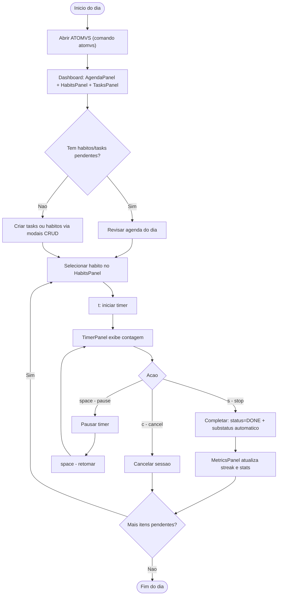

# Fluxo de Atividade: Dia Típico do Usuário

- **Status:** Aceito
- **Data:** 2026-04-06

**Atalhos alternativos (HabitsPanel):** `s` skip, `v` done (sem timer), `u` undo.

**Referências:**

- ADR-034: Dashboard-first CRUD
- ADR-037: TUI keybindings standard
- ADR-038: Dashboard interaction patterns
