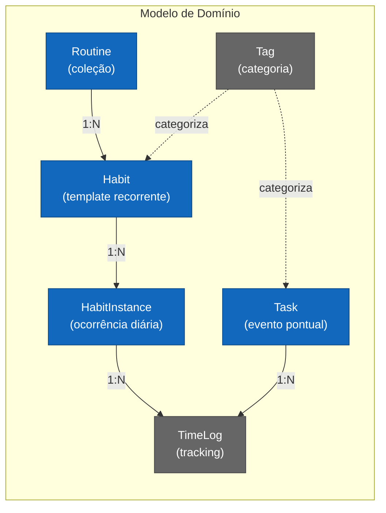
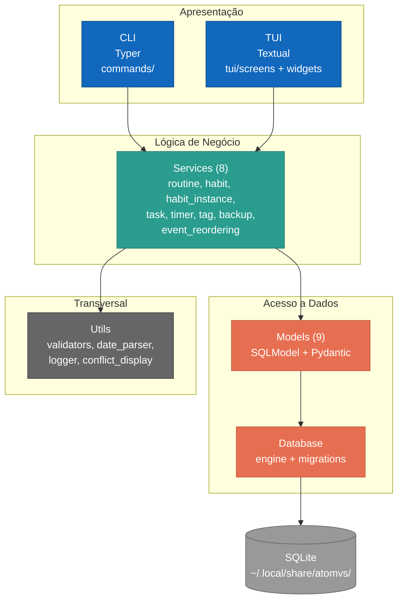
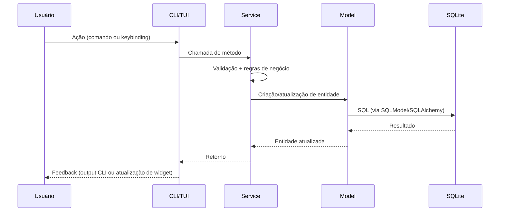

# Visão Geral da Arquitetura

- **Status:** Aceito
- **Data:** 2026-04-06

---

## Visão Geral

Este diagrama apresenta a arquitetura completa do ATOMVS Time Planner em uma única visão, combinando o modelo de domínio, as camadas da aplicação e o fluxo de dados. Serve como ponto de entrada para compreender o sistema antes de consultar os diagramas C4 e de dados mais detalhados.

---

## Modelo de Domínio

O ATOMVS organiza o tempo através de cinco conceitos centrais. Rotinas agrupam hábitos tematicamente (ex: "Rotina Matinal"). Hábitos são templates recorrentes que geram instâncias concretas para cada dia aplicável. Tarefas são eventos pontuais, independentes de rotinas. Tags categorizam tanto hábitos quanto tarefas. O timer rastreia tempo dedicado via TimeLog.

---

## Camadas da Aplicação

A arquitetura segue o padrão de camadas com separação estrita de responsabilidades. CLI e TUI são thin wrappers que delegam toda a lógica para a camada de services. Nenhuma regra de negócio reside na camada de apresentação.

---

## Fluxo de Dados

O fluxo é unidirecional: input do usuário entra pela camada de apresentação, atravessa services (que aplicam regras de negócio e validações), chega aos models (que mapeiam para tabelas SQLite via SQLModel) e persiste no banco local.

Na TUI, a comunicação entre widgets segue o padrão de message passing do Textual. Widgets emitem Messages tipadas (ex: `TimerStartRequest`, `HabitDoneRequest`), que o DashboardScreen recebe como coordinator e delega para services via `service_action()`.

---

## Referências

- [ER Diagram](../data/er-diagram.md) — modelo relacional detalhado (9 tabelas)
- [Class Diagram](../data/class-diagram.md) — classes, campos e relationships
- [L1 System Context](../c4-model/L1-system-context.md) — contexto externo
- [L2 Containers](../c4-model/L2-containers.md) — containers e dependências
- [L3 Components](../c4-model/L3-components-core.md) — componentes internos
- [Deployment](../infrastructure/deployment.md) — infraestrutura de runtime e CI/CD
- ADR-006: Textual TUI
- ADR-007: Service Layer pattern
- ADR-034: Dashboard-first CRUD
