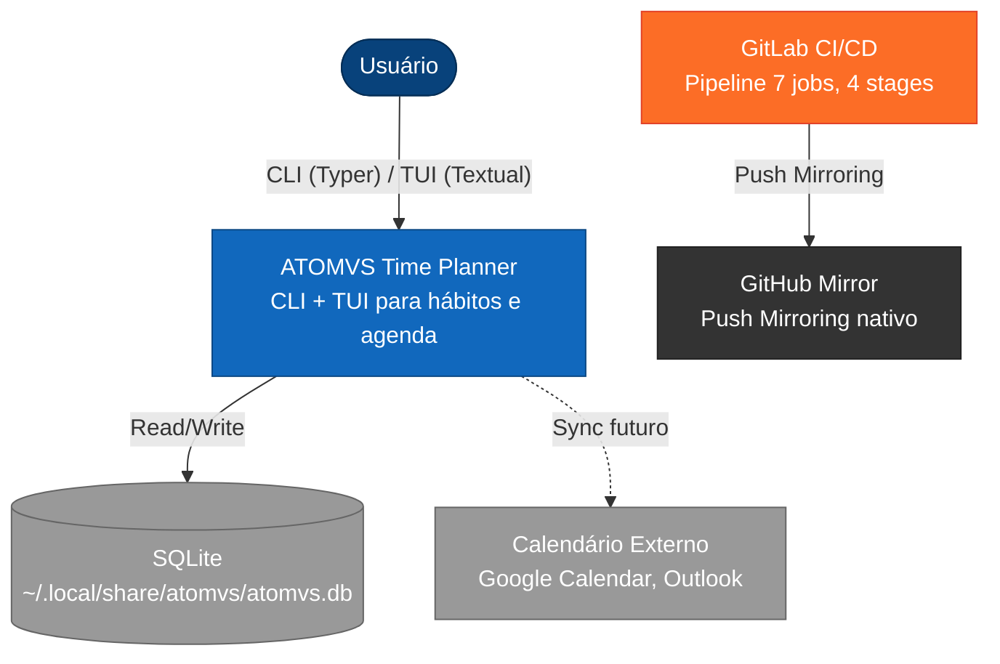

# C4 Level 1: System Context

- **Status:** Aceito
- **Data:** 2026-04-06

## Elementos

**Usuário:** Pessoa organizando tempo e cultivando hábitos via terminal.

**ATOMVS Time Planner:** Sistema core — Python 3.13+, SQLite local-first. Duas interfaces: CLI (Typer) para operações rápidas e TUI (Textual) para dashboard interativo. Comando de entrada: `atomvs`.

**SQLite:** Banco local em `~/.local/share/atomvs/atomvs.db` (XDG Base Directory). Logs em JSON Lines no mesmo diretório.

**GitLab CI/CD:** Pipeline com 7 jobs em 4 stages (quality, test, coverage, security). Imagem Docker customizada no Container Registry.

**GitHub Mirror:** Showcase via Push Mirroring nativo do GitLab. GitHub não é fonte de verdade.

**Calendário Externo:** Sincronização futura com Google Calendar/Outlook via CalDAV (planejado para v2.0+).
