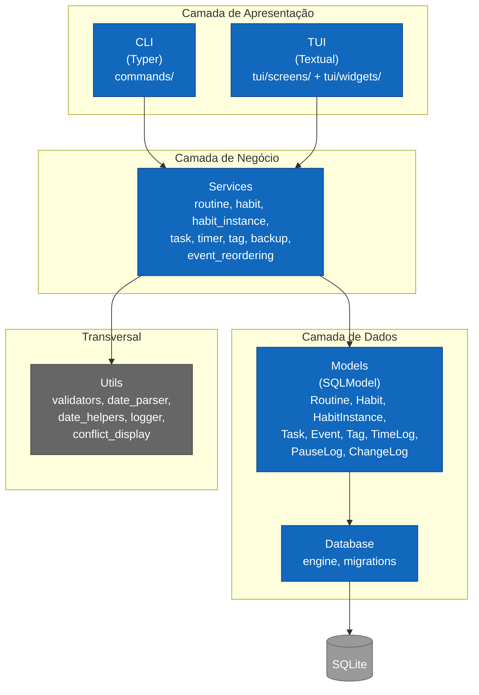

# C4 Level 2: Containers

- **Status:** Aceito
- **Data:** 2026-04-06

---

## Visão geral

O ATOMVS Time Planner segue uma arquitetura em camadas com separação estrita de responsabilidades. A camada de apresentação possui dois containers independentes (CLI e TUI) que compartilham 100% da camada de serviços — nenhuma lógica de negócio é duplicada entre interfaces.

O princípio arquitetural central é que ambas as interfaces são thin wrappers: a CLI parseia argumentos e formata output, a TUI gerencia widgets e navegação. Toda regra de negócio, validação e persistência reside na camada de serviços e modelos.

---

## Diagrama

---

## Containers

### CLI (Typer)

Interface de linha de comando organizada por recurso (`commands/routine.py`, `commands/habit/`, `commands/task.py`, `commands/timer/`, `commands/tag.py`, `commands/demo.py`). Cada módulo é um `typer.Typer()` registrado como subcomando do app principal. Output formatado via Rich (`Console`, `Table`, `Panel`). A CLI existe desde a v1.0.0 e é usada para operações rápidas, scripting e automação.

### TUI (Textual)

Interface terminal visual introduzida na v1.7.0 como complemento à CLI. O ponto de entrada é `atomvs` sem argumentos, que instancia `TimeBlockApp` (subclasse de `textual.App`). A arquitetura interna segue um padrão de coordinator: `DashboardScreen` recebe Messages dos widgets (ex: `TimerStartRequest`, `HabitDoneRequest`) e delega para services via a função utilitária `service_action()`, que encapsula criação de sessão e tratamento de erros.

Cinco screens (dashboard, routines, habits, tasks, timer) são pré-instanciadas no `compose()` do app e alternadas via NavBar (teclas 1–5). 12+ widgets especializados compõem o layout: AgendaPanel, HabitsPanel, TasksPanel, TimerPanel, MetricsPanel, NavBar, HeaderBar, StatusBar, HelpOverlay, CommandBar, FormModal e ConfirmDialog.

### Services

8 services com lógica de negócio pura, sem dependência de framework de apresentação. Padrão consistente: métodos estáticos com `session: Session | None = None` para permitir injeção de sessão em testes. Cada service opera sobre um ou mais models e encapsula toda a lógica de persistência (queries, transações, commits).

### Models (SQLModel)

9 modelos que combinam definição de tabela (SQLAlchemy) com validação de dados (Pydantic) em uma única classe. Enums em `enums.py` definem vocabulários fechados para status, substatus e tipos. HabitInstance inclui `validate_status_consistency()` como invariante de domínio.

### Database

`engine.py` gerencia o lifecycle da conexão SQLite com path configurável via XDG. `migrations/` contém scripts incrementais executados no startup. A separação em módulo próprio isola a infraestrutura de persistência do restante da aplicação.

### Utils

Módulos transversais usados por services e commands: validadores de range de horários, parser de datas relativas ("hoje", "amanhã", "+3d"), logger estruturado (JSON Lines), e formatação de conflitos para output Rich.

---

## Referências

- ADR-006: Textual TUI
- ADR-007: Service Layer pattern
- ADR-034: Dashboard-first CRUD
- ADR-009: Flags consolidation
