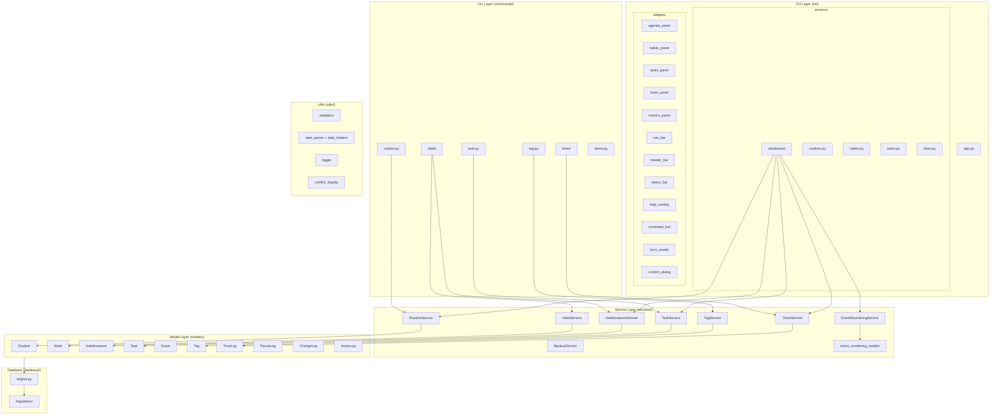

# C4 Level 3: Componentes do Core

- **Status:** Aceito
- **Data:** 2026-04-06

---

## Visão geral

Este diagrama detalha os componentes internos do ATOMVS Time Planner, expandindo os containers definidos no L2. O sistema possui 6 módulos CLI, 5 screens TUI com 12+ widgets, 8 services de negócio, 9 modelos de dados e módulos utilitários transversais.

A comunicação entre camadas é unidirecional: apresentação → serviços → modelos → banco. A TUI introduz um nível adicional de indireção com o padrão de message passing entre widgets e o DashboardScreen como coordinator.

---

## Diagrama de componentes

---

## CLI Layer (commands/)

Comandos Typer organizados por recurso, cada um registrado como subcomando do app principal via `typer.Typer()`. A estrutura segue o padrão CRUD consistente: cada recurso expõe `create`, `list`, `update` e `delete` (ou subconjunto aplicável).

**routine.py** — CRUD de rotinas. Inclui `activate`/`deactivate` para controlar qual rotina está ativa (apenas uma por vez, BR-ROUTINE-001).

**habit/** — Subpacote com `crud.py` (create, list, update, delete) e `display.py` (listagem filtrada de instâncias por data/status). A criação aceita `--generate N` para gerar instâncias em batch.

**task.py** — CRUD de tarefas pontuais. Inclui `check` (marcar como completa) e `cancel` (soft delete via `cancelled_datetime`).

**timer/** — Controle de cronômetro: `start`, `pause`, `resume`, `stop`, `cancel`. Cada comando delega para `TimerService` e formata o resultado via Rich.

**tag.py** — CRUD de tags (categorias com nome e cor).

**demo.py** — Popula o banco com dados demonstrativos (3 rotinas, 8+ tasks) ou limpa dados existentes. Usado para showcase e testes manuais.

---

## TUI Layer (tui/)

### App (app.py)

`TimeBlockApp` é a subclasse de `textual.App` que define o layout global: NavBar (sidebar) + HeaderBar + container de screens + StatusBar. Bindings de nível app: `1-5` para alternar screens, `?` para help overlay, `Ctrl+Q` para sair, `Escape` para voltar.

### Screens (screens/)

**dashboard/** — Screen principal e mais complexa. Subdivide-se em `screen.py` (coordinator que gerencia messages e state), `loader.py` (busca dados via services e transforma em dicts para os panels), `crud_habits.py`, `crud_routines.py` e `crud_tasks.py` (modais CRUD específicos). O DashboardScreen instancia e orquestra 6 widgets: AgendaPanel, HabitsPanel, TasksPanel, TimerPanel, MetricsPanel e TimeblockGrid.

**routines.py, habits.py, tasks.py** — Screens CRUD dedicadas, acessíveis via NavBar (teclas 2–4). Cada uma usa o widget genérico `CrudScreen` com formulários específicos.

**timer.py** — Screen dedicada do timer com keybindings próprios (`s` start, `p` pause/resume, `enter` stop, `c` cancel). Atualmente conectada parcialmente aos services (TODOs no código para integração completa).

### Widgets (widgets/)

Os widgets são componentes Textual reutilizáveis que seguem o padrão de message passing: capturam input do usuário, emitem Messages tipadas e delegam a lógica para o coordinator (DashboardScreen).

**Painéis de dados:** `agenda_panel` (grade de horários do dia), `habits_panel` (lista de instâncias com keybindings t/s/v/u), `tasks_panel` (lista de tarefas pendentes), `timer_panel` (exibição do timer ativo com keybindings space/s/c), `metrics_panel` (streak, completion rate, estatísticas da rotina).

**Infraestrutura de UI:** `nav_bar` (sidebar com navegação 1–5), `header_bar` (título de screen + data contextual), `status_bar` (hints de keybindings), `help_overlay` (modal de ajuda ativado com `?`), `command_bar` (stub para futura command palette com `/`).

**Componentes de interação:** `form_modal` (formulários CRUD genéricos), `confirm_dialog` (diálogos de confirmação sim/não), `crud_screen` (base para screens CRUD), `card` (container visual estilizado), `focusable_panel` (base para painéis navegáveis com j/k), `timeblock_grid` (grade semanal de rotinas).

---

## Service Layer (services/)

Services encapsulam toda a lógica de negócio. Padrão consistente: classe com métodos `@staticmethod`, cada método aceita `session: Session | None = None` para permitir injeção em testes (evita acoplamento com engine global). Internamente, cada método define uma closure `_nome(sess: Session)` que executa a lógica, e o wrapper externo decide se usa a sessão injetada ou cria uma nova.

**RoutineService** — CRUD + ativação exclusiva (apenas uma rotina ativa por vez). Gerencia `best_streak` persistido.

**HabitService** — CRUD de templates de hábito. Validação de recorrência e integração com RoutineService para resolver rotina ativa.

**HabitInstanceService** — Geração de instâncias, skip com categorização (SkipReason), marcação como completa com substatus, ajuste de horários. Núcleo do domínio de hábitos.

**TaskService** — CRUD + complete, cancel (soft delete), reopen. Adiamento incrementa `postponement_count` (BR-TASK-008).

**TimerService** — Start, pause, resume, stop, cancel, reset. O `stop_timer` é o método mais complexo: calcula duração efetiva, completion percentage e atribui substatus automaticamente ao HabitInstance.

**TagService** — CRUD simples de categorias (nome + cor hex).

**BackupService** — Cria cópia do banco SQLite antes de migrations. Proteção contra migrations destrutivas.

**EventReorderingService** — Detecção de conflitos (sobreposição de horários) entre tasks, habit instances e events. Usa dataclasses em `event_reordering_models.py`: `ConflictType` (enum), `Conflict`, `ProposedChange`, `ReorderingProposal`.

---

## Model Layer (models/)

9 modelos SQLModel que mapeiam tabelas do banco com validação Pydantic integrada. Cada modelo herda de `SQLModel` com `table=True` e define `__tablename__` explícito.

**Enums** (`enums.py`): `Status` (PENDING, DONE, NOT_DONE), `DoneSubstatus` (FULL, PARTIAL, OVERDONE, EXCESSIVE), `NotDoneSubstatus` (SKIPPED_JUSTIFIED, SKIPPED_UNJUSTIFIED, IGNORED), `SkipReason` (8 categorias em português), `TimerStatus` (RUNNING, PAUSED, DONE, CANCELLED). Enums de Event: `EventStatus` (6 estados), `ChangeType` (5 tipos). Recorrência: `Recurrence` (10 padrões).

**Validação de domínio:** `HabitInstance.validate_status_consistency()` garante invariantes entre status e substatus (ex: DONE requer `done_substatus` preenchido, SKIPPED_JUSTIFIED requer `skip_reason`). `HabitInstance.reset_to_pending()` centraliza a lógica de undo.

**Task.derived_status():** Property computada que retorna "pending", "overdue", "completed" ou "cancelled" a partir de timestamps. Task não persiste status — o estado é sempre derivado.

---

## Utils (utils/)

**validators.py** — Validação de ranges de horários, sobreposições e regras de domínio reutilizáveis.

**date_parser.py + date_helpers.py** — Parsing de datas relativas ("+3d", "amanhã", "próxima segunda") e utilitários de formatação/cálculo de datas.

**logger.py** — Configuração de logging estruturado via `python-json-logger`. Exporta `get_logger(name)` usado por todos os módulos. Suporta `configure_logging(console=False)` para modo TUI.

**conflict_display.py** — Formatação de conflitos detectados pelo EventReorderingService para output Rich (tabelas coloridas com detalhes de sobreposição).

---

## Database (database/)

**engine.py** — Gerencia criação do engine SQLAlchemy/SQLModel com path SQLite configurável via XDG Base Directory. Exporta `get_db_path()` e `get_engine_context()` (context manager para uso em services).

**migrations/** — Scripts Python incrementais de migration executados no startup via `run_pending_migrations()`. Cada migration verifica se já foi aplicada antes de executar (idempotente). `BackupService.create_backup()` é chamado antes de qualquer migration.

---

## Referências

- ADR-006: Textual TUI
- ADR-007: Service Layer pattern
- ADR-034: Dashboard-first CRUD
- ADR-037: TUI keybindings standard
- ADR-038: Dashboard interaction patterns
