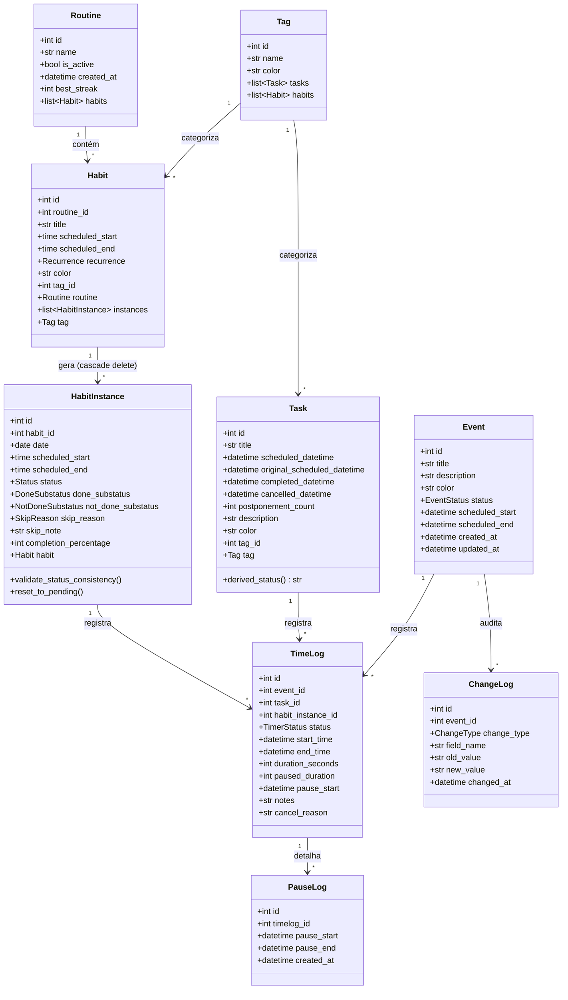

# Diagrama de Classes: Models

- **Status:** Aceito
- **Data:** 2026-04-06

**Relacionamentos principais:**

- Routine → Habit: 1:N (back_populates)
- Habit → HabitInstance: 1:N (cascade delete)
- Tag → Habit: 1:N (opcional)
- Tag → Task: 1:N (opcional)
- TimeLog → HabitInstance/Event/Task: N:1 (FKs opcionais, polimórfico)
- PauseLog → TimeLog: N:1
- ChangeLog → Event: N:1

**Nota:** `Task.derived_status()` é uma property computada — retorna "pending", "overdue", "completed" ou "cancelled" a partir de timestamps. Não existe campo `status` persistido em Task.

**Referências:**

- ADR-004: Habit vs Instance separation
- ADR-007: Service Layer pattern
- ADR-021: Refatoração status/substatus
