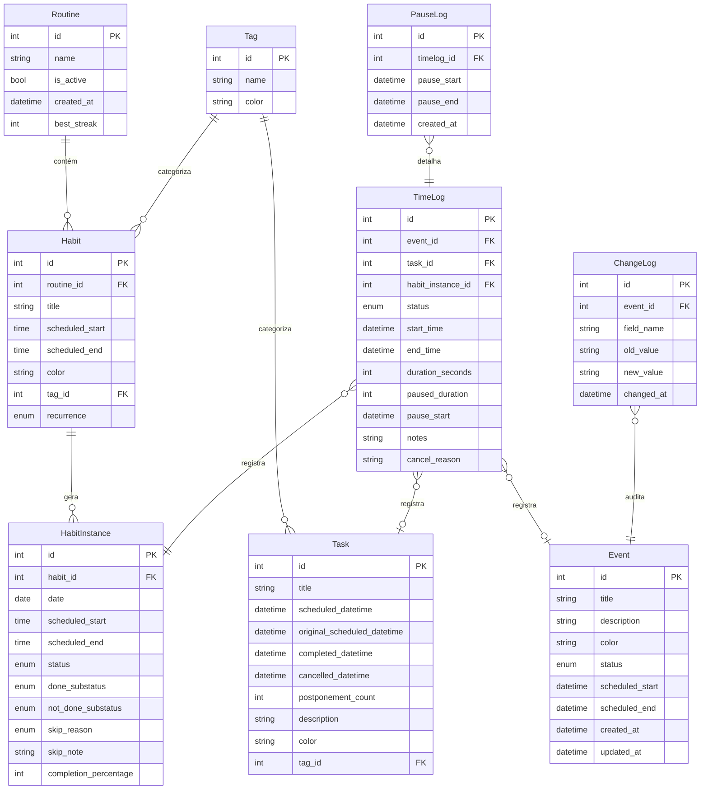

# ER Diagram

- **Status:** Aceito
- **Data:** 2026-04-06

**Tabelas (9):** routines, habits, habitinstance, tasks, event, tags, time_log, pauselog, changelog.

**Enums referenciados:** `Status` (PENDING, DONE, NOT_DONE), `DoneSubstatus`, `NotDoneSubstatus`, `SkipReason`, `TimerStatus` (RUNNING, PAUSED, DONE, CANCELLED), `EventStatus`, `Recurrence`, `ChangeType`.

**Nota:** `Task` não possui campo `status` persistido — o status é derivado via `derived_status` a partir dos timestamps (`cancelled_datetime`, `completed_datetime`, `scheduled_datetime`).

**Referências:**

- ADR-004: Habit vs Instance separation
- ADR-021: Refatoração status/substatus
