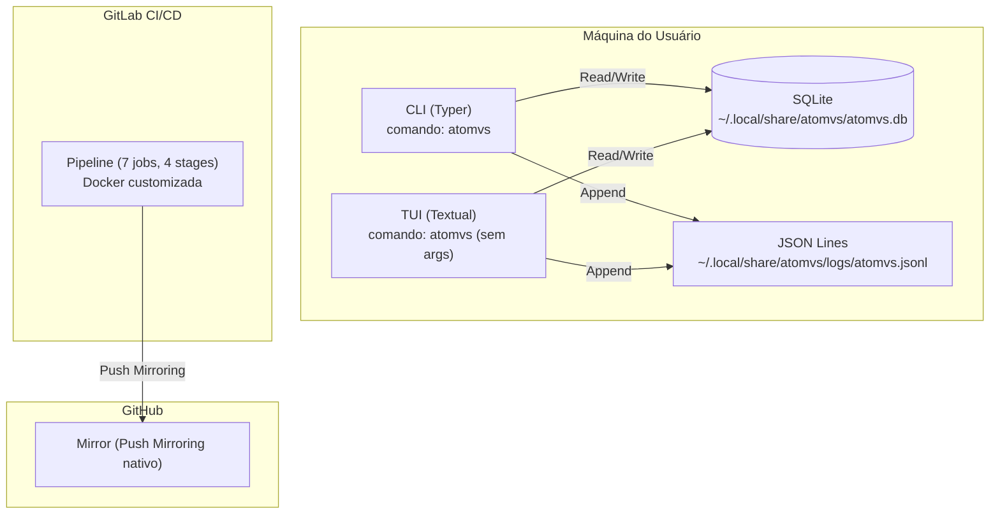

# Diagrama de Deployment

- **Status:** Aceito
- **Data:** 2026-04-06

---

## Visão geral

O ATOMVS Time Planner opera inteiramente na máquina do usuário, sem dependências de serviços externos em runtime. A filosofia é local-first: o banco de dados é um arquivo SQLite no filesystem local e toda a lógica roda no processo Python do terminal. A infraestrutura de desenvolvimento (CI/CD, mirroring) é separada do runtime.

---

## Diagrama

---

## Runtime

**Python:** 3.13+ (definido em `pyproject.toml` como `requires-python = ">=3.13"`).

**Interfaces:** Duas interfaces coexistem no mesmo binário. O comando `atomvs` sem argumentos abre a TUI (Textual) com dashboard interativo. Subcomandos (`atomvs routine create`, `atomvs habit list`, etc.) usam a CLI (Typer) com output via Rich.

**Dependências core:** typer (CLI framework), sqlmodel (ORM sobre SQLAlchemy + Pydantic), rich (formatação de terminal), python-dateutil (parsing de datas), python-json-logger (logging estruturado).

**Dependência opcional:** textual (TUI framework), instalada via `pip install -e ".[tui]"`. A CLI funciona sem Textual instalado.

---

## Persistência

**Banco de dados:** SQLite 3.x em `~/.local/share/atomvs/atomvs.db`, seguindo a especificação XDG Base Directory. Se a variável `XDG_DATA_HOME` estiver definida, o banco fica em `$XDG_DATA_HOME/atomvs/atomvs.db`. O diretório é criado automaticamente no primeiro uso.

**Migrations:** Executadas automaticamente no startup via `run_pending_migrations()`. O `BackupService` cria uma cópia do banco antes de qualquer migration para permitir rollback manual. Cada migration é um script Python incremental em `database/migrations/`.

**Logging:** Registros estruturados em JSON Lines (uma entrada JSON por linha) em `~/.local/share/atomvs/logs/atomvs.jsonl` via `python-json-logger`. No modo TUI, o output de console é suprimido (`configure_logging(console=False)`) para não interferir na interface — logs vão apenas para arquivo.

---

## Infraestrutura de desenvolvimento

**CI/CD:** Pipeline GitLab com 7 jobs organizados em 4 stages:

- **quality:** lint (ruff check + ruff format)
- **test:** unit, integration, e2e, typecheck (basedpyright)
- **coverage:** report (pytest-cov)
- **security:** bandit (SAST), deps (pip-audit)

A pipeline roda em imagem Docker customizada no GitLab Container Registry, construída com todas as dependências do projeto pré-instaladas para reduzir tempo de execução (~18 min end-to-end).

**Mirror:** O GitHub é sincronizado automaticamente via GitLab Push Mirroring nativo (Settings → Repository → Mirroring). Cada push ao GitLab dispara sincronização para o GitHub. O GitHub serve como showcase/portfolio — a fonte de verdade é o GitLab. A proteção de branches existe apenas no GitLab.

---

## Referências

- ADR-040: Unified database path
- ADR-044: Pyright CI (3 fases)
- DT-072: Migração sync:github → Push Mirroring nativo
