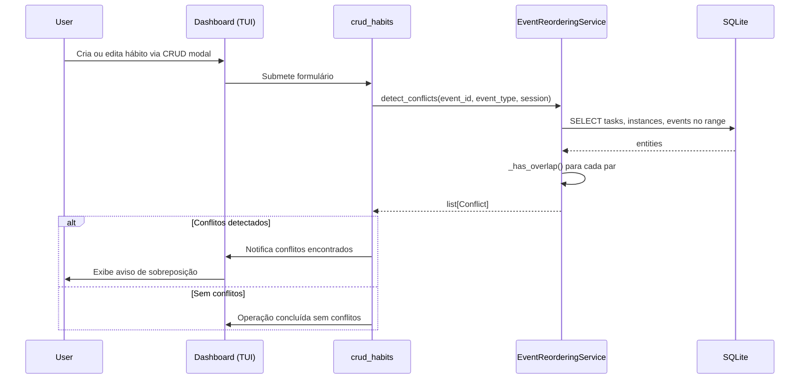

# Sequência: Event Reordering

- **Status:** Aceito
- **Data:** 2026-04-06

**Modelo de dados:** Conflitos são representados por dataclasses em `event_reordering_models.py`: `ConflictType` (enum), `Conflict`, `ProposedChange`, `ReorderingProposal`.

**Métodos públicos:**

- `detect_conflicts(triggered_event_id, event_type, session)` — detecta conflitos para uma entidade específica após CRUD
- `get_conflicts_for_day(target_date, session)` — detecta todos os conflitos de um dia (disponível mas não usado na TUI atualmente)

**Referências:**

- BR-EVENT-001: Detecção de conflitos
- ADR-003: Event reordering
