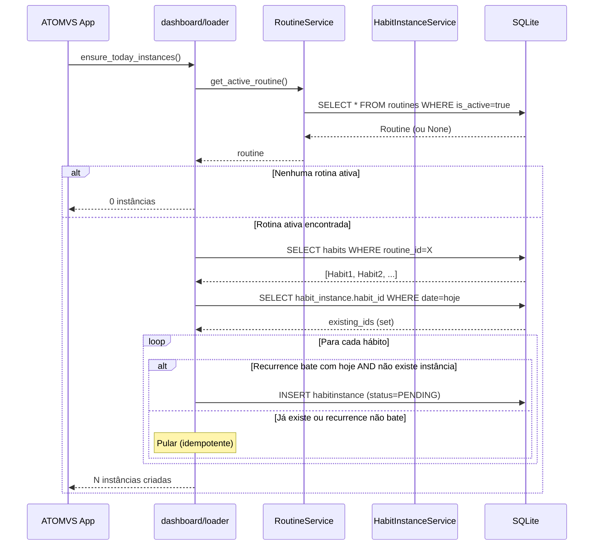
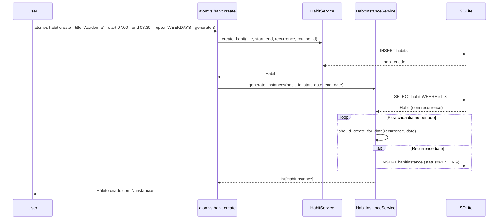

# Sequência: Geração de Instâncias de Hábito

- **Status:** Aceito
- **Data:** 2026-04-06

---

## Visão geral

A geração de instâncias é o mecanismo que transforma hábitos (templates recorrentes) em instâncias concretas para datas específicas. Existem dois fluxos distintos: a geração automática no startup da TUI, que cria instâncias apenas para o dia corrente, e a geração batch via CLI, que cria instâncias para um período arbitrário de dias.

Ambos os fluxos compartilham a mesma lógica de recorrência (`_should_create_for_date`) e produzem instâncias com `status=PENDING`, prontas para execução pelo usuário. A diferença está no escopo e na garantia de idempotência.

---

## Fluxo principal — TUI (startup diário)

Quando o usuário abre o ATOMVS (comando `atomvs` sem argumentos), a função `ensure_today_instances()` em `dashboard/loader.py` é chamada antes de renderizar o dashboard. Ela consulta a rotina ativa, busca todos os hábitos vinculados, verifica quais já possuem instância para hoje (via SELECT IN com set lookup), e cria apenas as faltantes. É idempotente por design — chamadas repetidas no mesmo dia não duplicam instâncias.

---

## Fluxo alternativo — CLI (geração batch)

O comando `atomvs habit create` com a flag `--generate N` cria o hábito e gera instâncias para N meses à frente. Este fluxo usa `HabitInstanceService.generate_instances(habit_id, start_date, end_date)`, que itera dia a dia pelo período, verifica a recorrência e insere instâncias em batch com commit único.

Diferente do fluxo TUI, a geração batch não verifica duplicatas explicitamente — a responsabilidade é do caller de não invocar duas vezes para o mesmo período. Esse trade-off é aceitável porque o comando CLI é interativo e executado uma vez.

---

## Sistema de recorrência

O enum `Recurrence` define 10 padrões: os 7 dias da semana (MONDAY a SUNDAY), dois agregados (WEEKDAYS e WEEKENDS) e EVERYDAY. Cada hábito tem exatamente um padrão atribuído no momento da criação.

O método privado `_should_create_for_date(recurrence, target_date)` resolve a lógica: compara o weekday da data-alvo com o padrão do hábito. Para WEEKDAYS (segunda a sexta), verifica `weekday < 5`. Para WEEKENDS, verifica `weekday >= 5`. Para EVERYDAY, retorna sempre `True`.

A recorrência é uma propriedade do Habit (template), não da HabitInstance. Cada instância herda `scheduled_start` e `scheduled_end` do template no momento da criação. Após criada, a instância é independente — alterar o template não afeta instâncias existentes.

---

## Garantias

**Idempotência (TUI):** A verificação batch (`SELECT IN` + set lookup) antes da inserção garante que o startup pode ser chamado múltiplas vezes sem duplicar. Isso é importante porque o ATOMVS pode ser aberto e fechado várias vezes ao dia.

**Atomicidade (CLI):** Todas as instâncias do período são inseridas em uma única transação (`sess.commit()` após o loop). Se qualquer inserção falhar, nenhuma é persistida.

**Consistência:** Instâncias são sempre criadas com `status=PENDING`, sem substatus. A transição para DONE ou NOT_DONE ocorre apenas por ação explícita do usuário.

---

## Referências

- BR-HABIT-001: Criação de hábitos
- BR-HABITINSTANCE-001: Geração de instâncias
- DT-023: Geração no startup da TUI
- ADR-004: Habit vs Instance separation
