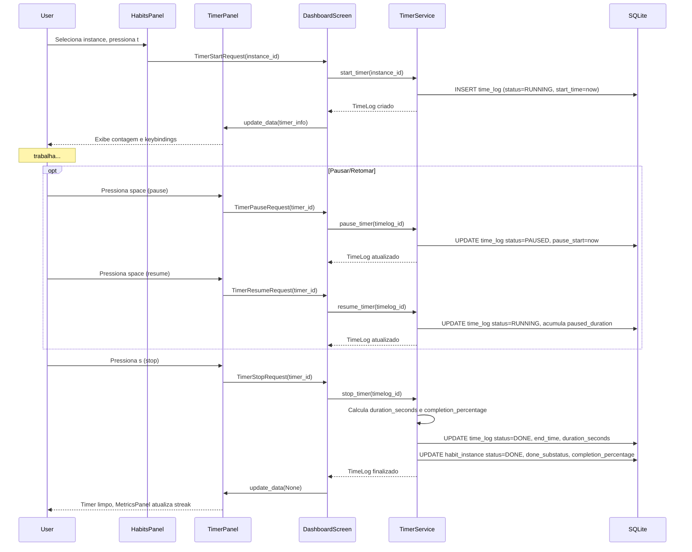

# Sequência: Timer Lifecycle

- **Status:** Aceito
- **Data:** 2026-04-06

**Keybindings (TimerPanel):** `space` pause/resume, `s` stop, `c` cancel.

**Referências:**

- BR-TIMER-001 a BR-TIMER-006
- BR-TUI-021: Keybinding t inicia timer
- BR-TUI-033: MetricsPanel
