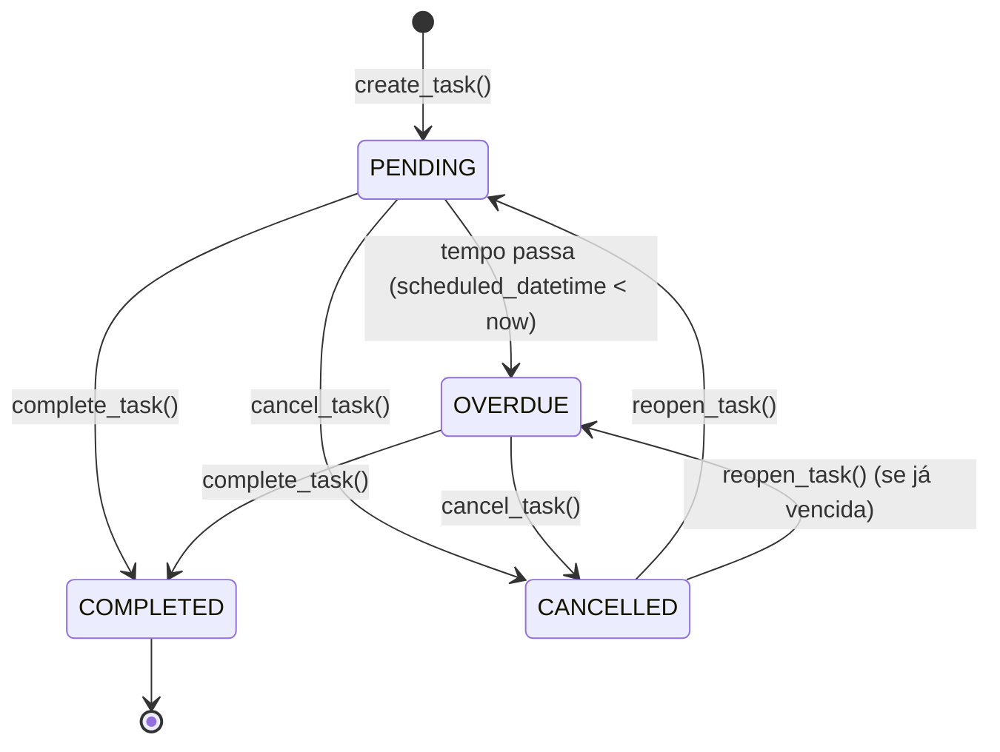

# Estados: Task Lifecycle

- **Status:** Aceito
- **Data:** 2026-04-06

## Modelo

`Task` não possui campo `status` persistido. O status é derivado pela property `derived_status()` a partir de timestamps:

1. `cancelled_datetime is not None` → "cancelled" (precedência máxima)
2. `completed_datetime is not None` → "completed"
3. `scheduled_datetime < now()` → "overdue"
4. Caso contrário → "pending"

## Transições

**PENDING → COMPLETED:** `TaskService.complete_task()` atribui `completed_datetime = now()`.

**PENDING/OVERDUE → CANCELLED:** `TaskService.cancel_task()` atribui `cancelled_datetime = now()` (soft delete, BR-TASK-009).

**CANCELLED → PENDING/OVERDUE:** `TaskService.reopen_task()` limpa `cancelled_datetime`. O status resultante depende de `scheduled_datetime` vs `now()`.

**PENDING → OVERDUE:** Transição implícita — não há ação explícita, `derived_status()` retorna "overdue" quando o tempo passa.

**Adiamento:** `TaskService.update_task()` com nova `scheduled_datetime` posterior incrementa `postponement_count` (BR-TASK-008). `original_scheduled_datetime` nunca muda.

## Nota

Não existe transição COMPLETED → PENDING. Uma task completada é terminal. Tasks canceladas podem ser reabertas, mas tasks completadas não.

**Referências:**

- BR-TASK-007: Status derivado de timestamps
- BR-TASK-008: Contagem de adiamentos
- BR-TASK-009: Soft delete via cancelled_datetime
- ADR-036: Task lifecycle evolution
