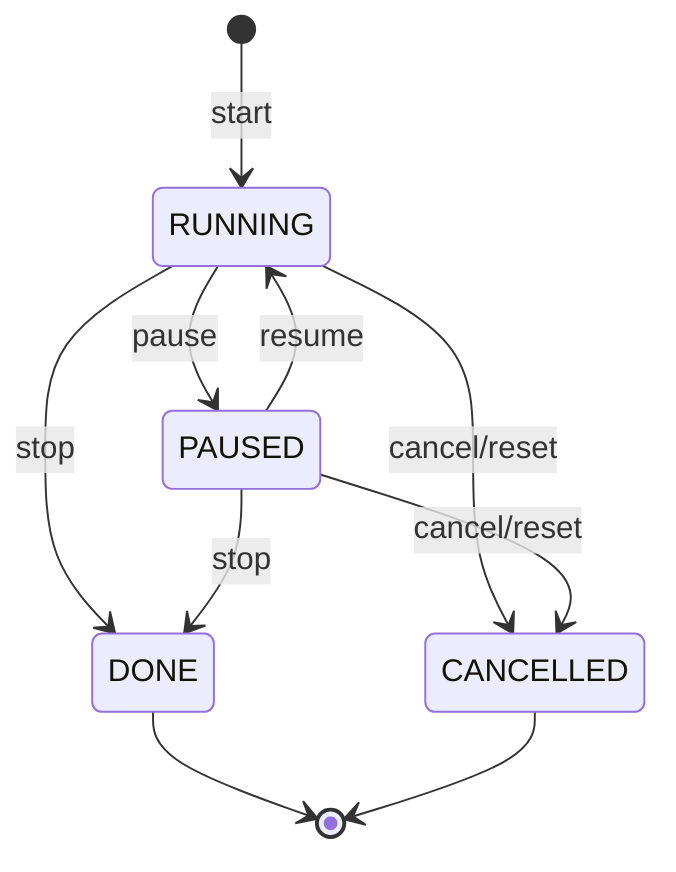

# Estados: Timer

- **Status:** Aceito
- **Data:** 2026-04-06

**Modelo:** `TimeLog` com campo `status: TimerStatus` (enum: RUNNING, PAUSED, DONE, CANCELLED).

O estado "idle" (sem timer ativo) é representado pela ausência de um `TimeLog` com status RUNNING ou PAUSED — não é um valor do enum `TimerStatus`.

**Transições:**

- `start` cria um novo `TimeLog` com `status=RUNNING` e `start_time=now()`
- `pause` muda para PAUSED e registra `pause_start`
- `resume` retorna para RUNNING, acumula `paused_duration`
- `stop` muda para DONE, calcula `duration_seconds`, atualiza `HabitInstance` para `Status.DONE` com substatus automático
- `cancel`/`reset` muda para CANCELLED, sessão descartada

**Keybindings (TimerPanel no Dashboard):** `space` pause/resume, `s` stop, `c` cancel.

**Referências:**

- BR-TIMER-002: Estados do timer
- ADR-021: Refatoração status/substatus
